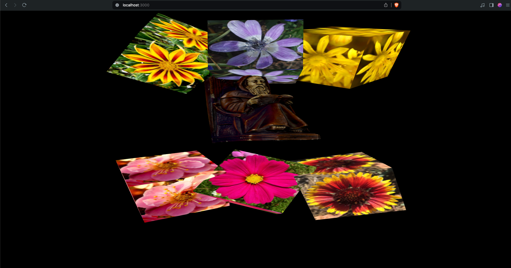

# 5a-high-level-graphics-library
graphics course 5A assignment: Exploring a High-Level Graphics Library (Medium)
  Screenshot of what running the server should look like:
 

  My resources folder also includes previous attempts of imported blender projects that did not work. I am keeping this here incase I want to revisit to find the issues that went wrong.
